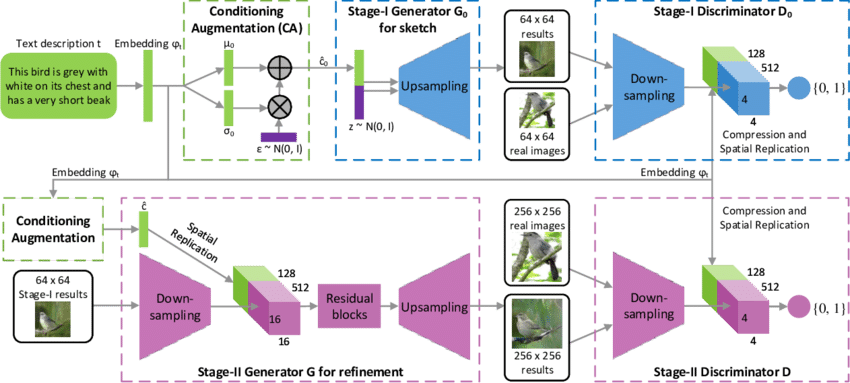

# StackGAN using tensorflow



I have used StackGAN to generate images from text. Architecture of StackGAN is as above. I have stopped the process after first stage of StackGAN but however it can be used for stage-2 as well.
[Link][identifier2] to the weights generated


## About dataset used

Dataset Name: Caltech-UCSD Birds-200-2011
Downloaded from : http://www.vision.caltech.edu/visipedia/CUB-200-2011.html

This dataset contains images for over 200 types of birds.

### Text Embedding Model
Downloaded char-CNN-RNN text embeddings for birds from [this link][identifier]

1. char-CNN-RNN-embeddings.pickle — Dataframe for the pre-trained embeddings of the text.
2. filenames.pickle — Dataframe containing the filenames of the images.
3. class_info.pickle — Dataframe containing the info of classes for each image.


#### Resource:
```
@inproceedings{han2017stackgan,
Author = {Han Zhang and Tao Xu and Hongsheng Li and Shaoting Zhang and Xiaogang Wang and Xiaolei Huang and Dimitris Metaxas},
Title = {StackGAN: Text to Photo-realistic Image Synthesis with Stacked Generative Adversarial Networks},
Year = {2017},
booktitle = {{ICCV}},
}
```

[identifier]: https://drive.google.com/file/d/0B3y_msrWZaXLT1BZdVdycDY5TEE/view?resourcekey=0-sZrhftoEfdvHq6MweAeCjA
[identifier2]: https://drive.google.com/drive/folders/1dZ09-ntDQ6edRQAyU0Jx4H8nx6UjHVEg?usp=drive_link
